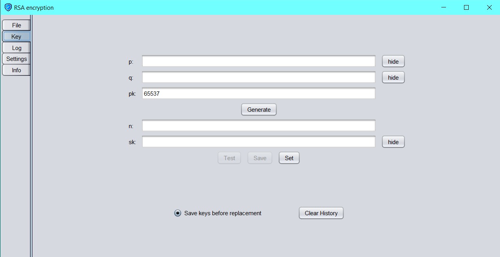

# RSA encyption

An application to encrypt messages using the RSA algorithm, written in java using the swing framework.

## Installation

For the application to run, java version 17 or higher is required. The JRE should not be headless since the GUI uses swing.

- Linux: download [linux.zip](https://github.com/MathewKJ2048/RSA-encryption/blob/main/downloads/linux.zip?raw=true) and run __run.sh__
- Windows: download either [windows_jar.zip](https://github.com/MathewKJ2048/RSA-encryption/blob/main/downloads/windows_jar.zip?raw=true) and run __run.bat__ or [windows_executable.zip](https://github.com/MathewKJ2048/RSA-encryption/blob/main/downloads/windows_executable.zip?raw=true)  and run __RSA encryption.exe__
- OSX: ~~go pound sand~~ download and run [RSA encryption.jar](https://rebrand.ly/r1ckr0l13r)

The [Users' Manual](https://github.com/MathewKJ2048/RSA-encryption/blob/main/doc/Users'%20Manual.md) contains further documentation.

## Featues

- Multiple Looks and Feels supported
- Editable Font Size
- All filetypes supported

## Credits

- Algorithm - [Rivest](https://scholar.google.com/citations?user=6qE0tdAAAAAJ&hl=en), [Shamir](https://scholar.google.com/citations?user=EHLBP20AAAAJ&hl=en) and [Adleman](https://viterbi.usc.edu/directory/faculty/Adleman/Leonard)
- Implementation - [Mathew K J](https://github.com/MathewKJ2048)
- GUI - [Mathew K J](https://github.com/MathewKJ2048)
- Look and Feel - [JTattoo](http://www.jtattoo.net)
- Icon - <a href="https://www.flaticon.com/free-icons/shield" title="shield icons">Shield icons created by Freepik - Flaticon</a>

The following software was used in this project:

- [BlueJ](https://www.bluej.org/)
- [IntelliJ IDEA Community edition](https://www.jetbrains.com/idea/)
- [Inkscape](https://inkscape.org/)
- [launch4j](http://launch4j.sourceforge.net/)
- [Big Prime Generator](https://bigprimes.org/)
