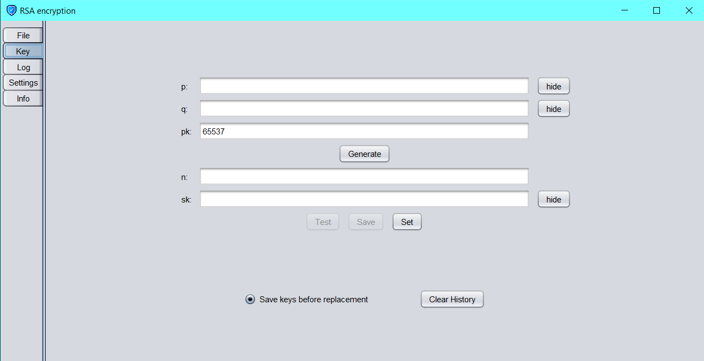

# Users' Manual

---

## Key Generation:

- A key is defined as a triplet (pk,sk,n) where sk is the secret key and pk is the public key.
- The default value given for pk is 65537 (216+1).
- A key (pk,sk,n) gan be generated from two prime numbers p and q along with pk.
- It is recommended that that both primes are very large and that one prime is significantly larger than the other.
- Key generation is carried out by entering the values of p,q and pk in the __Key__ tab.
- The key being used can be edited by setting the newly generated key or by changing the values of sk, pk or n directly in the __Settings__ tab.
- Once a new key is generated, it can be tested by clicking the __Test__ button. This uses the key to encrypt and decrypt a test file and checks whether each byte of the decrypted file is the same as the original file.

---

## Encrypting and decrypting files:

- A file can be chosen in the __File__ tab by clicking the __Load__ button.
- The encryption or decryption process is run in a separate thread, thus multiple files can be processed simultaneously.
- The __Memory__ field determines the amount of RAM used per file during processing.
- The processed files are saved in the destination folder with a Unix timestamp appended to it's name.

---

## Composing a message:

- If the user wishes to compose and encrypt a text message, the __Log__ tab can be used.
- An encrypted version of the message is saved in the destination folder when the __Save__ button is clicked.
- The __Delete__ button deletes the contents of the message permanently.

---

